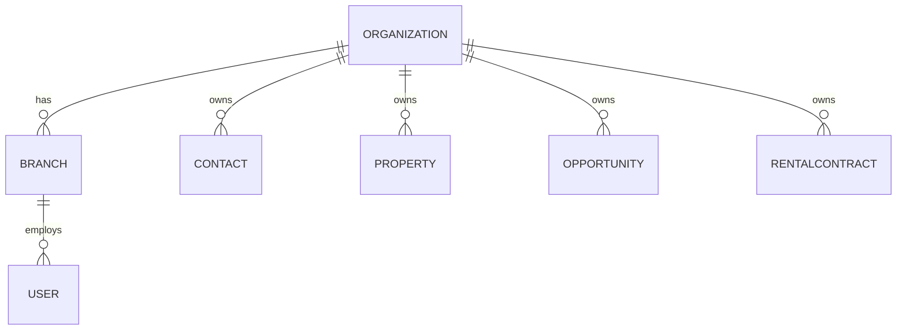

# Data Model

Conceptual domain model for Prototype v1. This is **not** a database schema
or a Prisma model — see [architecture.md](architecture.md#future-backend-architecture-not-implemented)
for why. Fields listed are the prototype's minimum; several are explicitly
flagged as pending validation with Fernández López (see
[requirements.md](requirements.md#open-questions)).

## Entity list

`Organization`, `Branch`, `User`, `Contact`, `Property`, `Opportunity`,
`Visit`, `RentalContract`, `ContractObligation`, `ContractCharge`,
`Payment`, `ContractMovement`, `Receipt`, `OwnerSettlement`, `Activity`.

## High-level relationships



Commercial flow:

```text
Contact
   │
   ▼
Opportunity
   │
   ├── Property
   │
   ▼
Visit
```

Rental flow:

```text
Property
    │
    ├── Owner Contact(s)
    ├── Tenant Contact(s)
    │
    ▼
RentalContract
    │
    ├── ContractObligation (embedded — which concepts apply, per contract)
    ├── ContractCharge
    │      └── Payment (via PaymentAllocation)
    │             └── Receipt (auto-issued per payment)
    ├── ContractMovement (derived view over the above — not stored)
    └── OwnerSettlement (separate from Receipt — net amount to the owner)
```

---

## Organization

**Purpose** — top-level tenant boundary for the future SaaS product.
Fernández López is the only organization today.

**Key fields** — `id`, `name`, plus optional prototype profile fields added
in Milestone 6 for the Settings → Inmobiliaria screen: `phone?`, `email?`,
`address?`, `timezone?`, `currency?` (`ARS | USD`), `cuit?`.

**Relationships** — has many `Branch`, `User`, `Contact`, `Property`,
`Opportunity`, `RentalContract` (all business entities carry
`organizationId`).

**Prototype assumptions** — a single mock "current organization" is enough;
no organization-switching UI is required. Editable via
`organization-service.ts#updateOrganization()`, `localStorage`-backed
(`fl.settings.organization`) — see
[modules/settings.md](modules/settings.md).

**Future concerns** — real tenant isolation, billing, org-level settings.
See [architecture.md](architecture.md#multi-tenant-and-organization-awareness).

## Branch

**Purpose** — a physical/operational office (`sede`) within an
organization.

**Key fields** — `id`, `organizationId`, `name`, `address?`, `phone?`,
`status` (`active | inactive`, added in Milestone 6 for Settings → Sedes —
branches are deactivated rather than deleted so linked contracts/properties
never dangle).

**Relationships** — belongs to `Organization`; has many `User`; business
entities may carry `branchId`.

**Prototype assumptions** — Fernández López has multiple branches; a branch
selector may filter dashboards/lists. CRUD (create/edit/activate/deactivate)
implemented in Milestone 6 (`organization-service.ts`), `localStorage`-backed
(`fl.settings.branches`) — see [modules/settings.md](modules/settings.md).

**Open question** — see
[requirements.md](requirements.md#open-questions) item 5 (which records are
branch-scoped vs. org-wide, whether agents cross branches).

## User

**Purpose** — a person who logs into the system (staff, not a client
contact).

**Key fields** — `id`, `organizationId`, `branchId`, `name`, `email`,
`role`, `status` (`active | inactive`, added in Milestone 6 for Settings →
Usuarios — deactivating removes access without deleting the record or
breaking historical `assignedUserId` references).

**Important enum — `role`**: `ADMIN | MANAGER | ADMINISTRATION | AGENT`. See
[product-overview.md](product-overview.md) for responsibilities per role.

**Relationships** — belongs to `Organization` and `Branch`; assigned to
`Opportunity`, `Visit`, `RentalContract` (as the responsible agent/user).

**Prototype assumptions** — no real authentication; a mock "current user"
drives role-aware UI. The dev-only role switcher
(`getDemoUserForRole()`) now prefers an **active** user for the target role,
falling back to any match, so deactivating a demo user in Settings can't
break the switcher. CRUD implemented in Milestone 6
(`user-service.ts`), `localStorage`-backed (`fl.settings.users`) — see
[modules/settings.md](modules/settings.md).

**Future concerns** — real auth, session management, permission matrix
validation (open question 6).

## Contact

**Purpose** — a single record for any person the agency interacts with.
**Never** create separate records per role.

**Key fields** (`src/types/contact.ts`) — `id`, `organizationId`,
`branchId`, `fullName`, `phone`, `email`, `assignedUserId`, `roles`,
`notes?`, `source?`, `lastActivityAt`, `createdAt`, `updatedAt`. A separate
`ContactNote { id, contactId, authorUserId, text, createdAt }` list holds
free-text notes (Milestone 3 — `contact-service.ts`).

**Important enum — `roles`** (a contact may hold several at once):
`prospect | tenant | buyer | owner | seller`, shown in the UI as
`Interesado | Inquilino | Comprador | Propietario | Vendedor`.

**Relationships** — has many `Opportunity` (`contactId`), `Visit`
(`contactId`); referenced by `RentalContract` as `tenantIds`/`ownerIds`
(not implemented yet); referenced by `Property` as `ownerIds` — **not**
directly (`Property.ownerIds` still points at the separate
`src/mocks/property-owners.ts` pool from Milestone 2). Milestone 3 closes
that gap for the *demo data* by generating one `Contact` (role `owner`) per
`PropertyOwner` with a matching phone number, so `PropertyOwnerCard` can
look the contact up (`findContactByPhone`) and link to it; the two ID
spaces remain formally separate until Property is remodeled to reference
`Contact` directly (see [architecture.md](architecture.md#known-gaps)).

**Prototype assumptions** — see
[modules/contacts.md](modules/contacts.md). Mock dataset: 100 contacts
plus 15 owner contacts (`src/mocks/contacts.ts`), edits persisted via
`localStorage` (`src/lib/local-store.ts`).

## Property

**Purpose** — a real estate unit the agency manages, sells, or rents.

**Key fields**:

```text
id, organizationId, branchId, referenceCode, address, floor, neighborhood,
city, latitude, longitude, propertyType, operationTypes, status,
salePrice, rentalPrice, rooms, bedrooms, bathrooms, surface,
coveredSurface, parkingSpaces, featured, description, images, ownerIds,
interest, createdAt, updatedAt
```

Implemented in Milestone 2 (`src/types/property.ts`), with a few prototype
additions beyond the original sketch: `referenceCode` (internal listing
code, e.g. `FL-1001`), `floor` (unit/floor, e.g. `4°A`), `coveredSurface`,
`parkingSpaces`, `featured`, and `interest` (`{ inquiries,
activeOpportunities, visitsThisMonth, lastInquiryAt?, assignedAgentName? }`
— powers the dashboard's high-interest widget, the Properties "Mayor
interés" sort, and the detail page's Comercial tab).

**Currency convention** — no separate `currency` field. `salePrice` is
always USD and `rentalPrice` is always ARS, matching real Argentine
real-estate practice; a property with both `operationTypes` carries both
prices independently.

**Important enums**:

- `propertyType`: apartment, house, PH, commercial property, office,
  parking, land, other (Spanish labels in UI).
- `operationTypes`: for sale, for rent (a property may be both).
- `status`: available, reserved, rented, sold, paused, under valuation.

**Relationships** — belongs to `Organization`/`Branch`; `ownerIds`
references a small fictional owner pool (`src/mocks/property-owners.ts`,
each entry now mirrored by a `Contact` — see [Contact](#contact) below);
has many `Opportunity` (via `Opportunity.linkedPropertyIds`,
`getOpportunitiesByProperty()`) and `Visit` (via `Visit.propertyId`,
`getVisitsByProperty()`) as of Milestone 3 — the property detail page's
Comercial/Visitas tabs read these instead of the static `interest` field;
`interest` itself is unchanged (still powers the Properties "Mayor
interés" sort and the property card badge, a Milestone 2 simplification
not revisited in Milestone 3); may have one active `RentalContract`.

**Prototype assumptions** — one dataset powers list/card/map views and the
dashboard's property widgets (see
[modules/properties.md](modules/properties.md)); not modeled to the depth of
a public property portal. Property-detail history and document lists are
**derived** from the property's own fields at render time
(`property-detail-derivations.ts`), not separately stored records.

## Opportunity

**Purpose** — a specific commercial intention tied to a `Contact`. A
`Contact` is a person; an `Opportunity` is what that person currently wants
(e.g. "Juan busca un departamento de 3 ambientes en Coghlan").

**Key fields** (`src/types/opportunity.ts`):

```text
id, organizationId, branchId, contactId, assignedUserId, type, stage,
budgetMin?, budgetMax?, currency?, preferredNeighborhoods?, propertyTypes?,
rooms?, ownerPropertyAddress?, linkedPropertyIds, notes?, lostReason?,
nextActionAt?, nextActionLabel?, lastActivityAt, createdAt, updatedAt
```

**Important enums**:

- `type`: `RENT_SEARCH | BUY_SEARCH | OWNER_RENT | OWNER_SELL` (demand-side
  vs. owner-side, `isOwnerOpportunity()`).
- `stage` (demand-side pipeline, `DEMAND_STAGES`): `Nueva → Contactado →
  Propiedades seleccionadas → Visita → Negociación → Reserva → Cerrada`, or
  `Perdida` (with a `lostReason`). **Provisional — open question 4.**
- `stage` (owner-side pipeline, `OWNER_STAGES`): `Nueva → Contactado →
  Tasación → Captación → Publicada → Cerrada`, or `Perdida`.
- `lostReason`: `No responde | No encontró propiedad | Presupuesto
  insuficiente | Eligió otra inmobiliaria | Postergó decisión | Otro`.

**Relationships** — belongs to `Contact`; `linkedPropertyIds` links zero or
more `Property` records (matched to compatible properties via
`getCompatibleProperties()`, budget/neighborhood/type/rooms heuristics);
has many `Visit` (`opportunityId`, optional — a visit can exist without an
opportunity).

**Stage-change history** is the one piece of `Opportunity` activity that
isn't derivable from the record itself (the previous stage is overwritten),
so it's the only event persisted through `activity-service.ts`; everything
else on the Actividad tab is derived at render time from timestamps. See
[modules/opportunities.md](modules/opportunities.md).

## Visit

**Purpose** — a scheduled or completed property visit.

**Key fields** (`src/types/visit.ts`) — `id`, `organizationId`,
`branchId`, `contactId`, `opportunityId?`, `propertyId`, `assignedUserId`,
`startAt`, `endAt`, `status`, `notes?`, `outcome?`, `createdAt`,
`updatedAt`.

**Important enums**:

- `status`: `Programada | Confirmada | Realizada | Cancelada |
  Reprogramada` (shared `VisitStatus`, `src/types/dashboard.ts`).
- `outcome` (set on completion via `completeVisit()`): `Interesado |
  Quiere reservar | No interesado | Reprogramar`.

**Relationships** — belongs to `Contact`, `Property`, and optionally
`Opportunity`; assigned to a `User`. Completing a visit
(`VisitDetailSheet` → `completeVisit()`) records the outcome on the `Visit`
itself, and — when the visit is linked to an `Opportunity` — feeds back
into that opportunity's `stage`: `Interesado → Negociación`, `Quiere
reservar → Reserva` (`VISIT_OUTCOME_STAGE_MAP`,
`features/visits/visit-labels.ts`). `No interesado`/`Reprogramar` are left
for the agent to act on manually, and the map only applies when the target
stage is valid for the opportunity's type, so owner-side opportunities are
unaffected. `hasConflict()` gives a soft double-booking warning per
agent/timeslot, not a hard scheduling constraint.

## RentalContract

**Purpose** — the legal/financial agreement connecting a property, its
owner(s), and tenant(s).

**Key fields** (`src/types/rental-contract.ts`, implemented in Milestone 4):

```text
id, organizationId, branchId, contractNumber, propertyId, tenantIds,
ownerIds, startDate, endDate, initialRent, currentRent, currency,
adjustmentMethod, adjustmentFrequency, lastAdjustmentDate?,
nextAdjustmentDate?, deposit?, guaranteeType?, status, documentUrl?,
notes?, createdAt, updatedAt
```

`startDate`/`endDate`/`lastAdjustmentDate`/`nextAdjustmentDate` are plain
`YYYY-MM-DD` calendar dates (matching `<input type="date">`), not full ISO
timestamps — every read of them goes through
`features/administration/expiration-utils.ts`'s `daysUntil()`, which parses
Y/M/D components directly rather than `new Date(dateOnly)` (which treats a
date-only string as UTC midnight and can shift the result by a day
depending on the browser's timezone offset — the same class of bug fixed in
the dashboard's contact-trend chart in Milestone 1).

**Important enums**:

- `status`: `DRAFT | UPCOMING | ACTIVE | EXPIRED | TERMINATED` (Borrador /
  Próximo / Activo / Vencido / Finalizado). Stored directly on the record
  (like `Opportunity.stage`), not derived live from dates — mock data is
  seeded consistent with the demo's fixed "today" (2026-09-21).
- `adjustmentMethod`: `IPC | ICL | MANUAL | OTHER`.
- `adjustmentFrequency`: `QUARTERLY | FOUR_MONTHLY | SEMIANNUAL | ANNUAL |
  CUSTOM` (Trimestral / Cuatrimestral / Semestral / Anual / Personalizada).
  `ADJUSTMENT_FREQUENCY_MONTHS` maps each to a cadence in months (`null`
  for `CUSTOM`, which has no fixed cadence).
- `guaranteeType`: `OWNER_GUARANTEE | INSURANCE | PAYSLIP | GUARANTOR |
  OTHER` (Garantía propietaria / Seguro de caución / Recibo de sueldo /
  Fiador / Otra).

**This is the initial prototype model, not a final legal schema** —
additional mandatory fields are open question 3.

**Relationships** — belongs to `Property`; references `Contact` via
`tenantIds`/`ownerIds`; has one `obligations` list (below) and, as of
Milestone 5, many `ContractCharge`, `Payment`, `Receipt`, `OwnerSettlement`.

**Expiration severity** (`expirationSeverity()`,
`features/administration/expiration-utils.ts` — the single source of truth,
reused by contract detail, the contracts list, the Vencimientos view, and
the dashboard attention panel):

| Band | Severity |
|---|---|
| 90–61 days | `within90` (informational) |
| 60–31 days | `within60` (warning) |
| 30–0 days | `within30` (urgent) |
| past `endDate` | `expired` (critical) |

**Simulated adjustment preview** (`simulateNextRent()`,
`features/administration/adjustment-utils.ts`) — a deterministic, clearly-
labeled demo variation per method (`IPC` +9.9%, `ICL` +7.4%; `MANUAL`/
`OTHER` have no automatic estimate), never a real INDEC/BCRA/ICL lookup.

**Prototype dataset** — 105 mock contracts (`src/mocks/rental-contracts.ts`
— curated scenarios A–J from the milestone spec, generated primary
contracts, and renewal-history contracts), `localStorage`-backed. Only 24
of the original 45 Milestone 2 properties have `operationTypes` including
`rent`, not enough to back ~100 realistic contracts without excessive
same-property renewal stacking — Milestone 4 additively extended
`mocks/properties.ts` with 50 more rent-eligible generated properties
(`prop-rental-N`) for this purpose; see
[modules/properties.md](modules/properties.md#prototype-behavior).

**AI contract intake** (`AIContractIntakeSheet` +
`ContractFormSheet reviewMode`) — simulated only: a deterministic mock
"extraction" (picks a vacant rent-eligible property and a tenant contact,
no real OCR/AI SDK) pre-fills the same creation form used for manual
contracts, with two fields marked "Confianza media" and an explicit
"Revisá los datos antes de confirmar" banner. The contract is only created
when the user submits the reviewed form — there is no auto-create path.

## ContractObligation

**Purpose** — which recurring concepts apply to a given contract, who is
responsible for each, and (for electricity/gas) which provider — separate
from any given month's amount. Implemented in Milestone 5
(`src/types/rental-contract.ts`).

**Key fields** — `type`, `enabled`, `provider?`, `responsibility?`,
`notes?`. One entry per `ObligationConceptType`, always present (seven
entries per contract) — embedded directly as `RentalContract.obligations`
rather than a separate store, since it's 1:1 owned data edited as a whole,
not a growing collection.

**Important enums**:

- `type` (`ObligationConceptType`): `RENT | EXPENSES | ABL | AYSA |
  ELECTRICITY | GAS | OTHER` (Alquiler / Expensas / ABL / AYSA /
  Electricidad / Gas / Otro). `RENT` is always `enabled`.
- `responsibility` (`ObligationResponsibility`): `TENANT | OWNER |
  BY_CONTRACT` (Inquilino / Propietario / Según contrato) — configured per
  contract and per concept, never assumed globally.
- `provider`: free text in the type, but the UI only offers a choice for
  `ELECTRICITY` (`Edenor` / `Edesur`) and fixes `GAS` to `Metrogas` — a
  contract shows at most one active electricity provider.

**Open question** — expense responsibility rules per concept (open question
1) — the `responsibility` field exists precisely because this isn't a
solved, universal rule; each contract's configuration is a business
decision, not a computed default.

## ContractCharge

**Purpose** — one line item owed under a contract for a given month.
Implemented in Milestone 5 (`src/types/contract-account.ts`,
`src/services/contract-charge-service.ts`).

**Key fields**:

```text
id, contractId, period, type, description, provider?, amount, paidAmount,
dueDate, status, responsibility?, source, notes?, createdAt, updatedAt
```

`period` is `YYYY-MM`. `paidAmount` is kept in sync by
`payment-service.ts`/`contract-charge-service.ts` whenever a payment
allocation is applied — it is not recomputed from `Payment` records on
every read.

**Important enums**:

- `type` (`ChargeType`): `ObligationConceptType | 'INTEREST'` — the same
  seven concepts plus `INTEREST` for late-payment penalties, which is
  never a `ContractObligation` (it's always a one-off manual charge, not a
  recurring concept a contract "has").
- `status` (`ChargeStatus`, stored): `PENDING | PARTIAL | PAID` only.
  `OVERDUE` is **not** a stored value — it's computed at display time by
  `effectiveChargeStatus()` (`features/administration/account-utils.ts`)
  from `dueDate` vs. today, so there's no separate transition to keep in
  sync when a day passes.
- `source`: `RECURRING` (generated from the contract's enabled
  obligations) or `MANUAL` (added via "Agregar concepto", e.g. an
  `INTEREST` charge).

**Monthly account generation rule** — the monthly account only shows
recurring charge rows for `ContractObligation`s that are `enabled` for
that contract; a disabled concept (e.g. `GAS`) never produces a charge.
When a provider is set, the charge's `description` shows the provider name
(e.g. "Edenor") rather than the generic concept label, matching what a
tenant actually sees on their bill.

## Payment

**Purpose** — a recorded payment from a tenant, applied to one or more
`ContractCharge` records via allocations. Implemented in Milestone 5
(`src/services/payment-service.ts`).

**Key fields**:

```text
id, contractId, date, amount, method, notes?, allocations, isCreditApplication?, createdAt
```

**`PaymentAllocation`** — `{ chargeId: string | null, amount: number }`.
`chargeId: null` means the amount is held as **unallocated credit** rather
than applied to a specific charge.

**Credit balance, without a separate balance field** — a contract's credit
balance is simply the sum of all `chargeId: null` allocations across its
payment history (`creditBalance()`,
`features/administration/account-utils.ts`):

- An **overpayment** (`amount` paid exceeds the sum of explicit
  allocations) automatically gets a `{ chargeId: null, amount: remainder }`
  allocation appended by `computePaymentAllocations()` — this is how
  "saldo a favor" is created.
- **Applying existing credit** to a new charge (`applyCreditToCharge()`) is
  modeled as a zero-cash payment (`amount: 0`, `isCreditApplication: true`)
  whose allocations are `[{ chargeId: <target>, amount }, { chargeId: null,
  amount: -amount }]` — money moves from the credit pool into a real
  charge, without ever needing a separately-maintained balance that could
  drift from the payment history that produced it.

**Important enum** — `method` (`PaymentMethod`): `TRANSFER | CASH |
DEPOSIT | OTHER` (Transferencia / Efectivo / Depósito / Otro).

**Explicitly not modeled**: cash registers, daily close, bank
reconciliation, general ledger — see
[architecture.md](architecture.md) and
[prototype-scope.md](prototype-scope.md#explicitly-out-of-scope-for-prototype-v1).

## ContractMovement

**Purpose** — a contract's chronological operational history ("Movimientos"
tab) — an *operational account movement*, explicitly **not** a formal
double-entry accounting journal entry.

**Always derived, never stored** — unlike `Opportunity`'s stage-change
log (the one case in this codebase that genuinely needs persisted
history), a contract's movements are fully reconstructible from
`ContractCharge`/`Payment`/`Receipt`/`OwnerSettlement` records, so
`buildContractMovements()` (`features/administration/movement-derivations.ts`)
computes them at read time instead of maintaining a parallel log that
could drift from the data it summarizes.

**Key fields** — `id`, `contractId`, `date`, `period?`, `type`,
`description`, `amount`, `direction`, plus whichever of `chargeId`/
`paymentId`/`receiptId`/`settlementId` the movement originated from.

**Important enums**:

- `type` (`MovementType`): `CHARGE_CREATED | PAYMENT_RECEIVED |
  PAYMENT_APPLIED | CREDIT_APPLIED | RECEIPT_ISSUED | SETTLEMENT_CREATED`.
  (`INTEREST_ADDED`/`MANUAL_ADJUSTMENT` from the original sketch are
  covered by `CHARGE_CREATED` with `type: 'INTEREST'`/`source: 'MANUAL'`
  — a manual interest charge already produces the right movement without
  a separate type.)
- `direction`: `DEBIT` (a charge — increases what's owed), `CREDIT` (a
  payment received — decreases what's owed), or `NEUTRAL` (informational:
  how a payment was applied, a credit consumption, a receipt/settlement
  being issued).

## Receipt

**Purpose** — a document issued to the tenant after a payment is recorded.
Implemented in Milestone 5 (`src/services/receipt-service.ts`).

**Key fields**:

```text
id, contractId, paymentId, number, date, period, items, total,
paymentMethod, notes?, createdAt
```

**Prototype behavior** — every real (non-zero-cash) payment automatically
generates its receipt (`payment-service.createPayment()` calls
`createReceipt()`) — there is no separate manual "issue receipt" step,
matching how a small agency actually operates (every payment received
gets a receipt). `ReceiptPage` is a print-friendly page
(`window.print()`, no PDF library) reusing the app's shell but hiding
navigation chrome via Tailwind's `print:hidden` — no ARCA (electronic
invoicing) integration.

## OwnerSettlement

**Purpose** — the periodic calculation of what the agency owes the property
owner after collecting rent and deducting its fee and any repairs — **not**
the same document as the tenant `Receipt`. Implemented in Milestone 5
(`src/services/owner-settlement-service.ts`).

**Key fields**:

```text
id, contractId, ownerIds, period, grossCollected, feeType, feeValue,
administrationFee, deductions, netAmount, status, notes?, createdAt, updatedAt
```

**Conceptual calculation** (`grossCollected` = the contract's paid `RENT`
charges for that period):

```text
Rent collected       $650,000
Administration fee   -$32,500
Repair                -$20,000
--------------------------------
Net to owner          $597,500
```

**Important enums**:

- `feeType`: `PERCENTAGE | FIXED` — the prototype supports either shape;
  Fernández López's real honorarium rule is still unvalidated (open
  question 2). The seeded default (5%) and the "Nueva liquidación" form's
  default are explicitly labeled "provisoria" in the UI, not presented as
  final.
- `status` (`SettlementStatus`): `DRAFT | READY | PAID` (Borrador / Lista /
  Pagada). No bank transfer integration — this only tracks the settlement
  document's own lifecycle.

**Open question** — administration fee / deduction rules (open question 2)
remain unresolved; this model supports recording a settlement, not
enforcing a validated business rule for computing one.

**Open question** — exact fee rules (open question 2).

## Activity

**Purpose** — a generic activity/history log entry (note added, stage
changed, visit completed, payment registered, etc.) attached to a `Contact`,
`Opportunity`, `Property`, or `RentalContract`, powering "Historial"/
"Actividad" tabs.

**Key fields** (`src/types/activity.ts`, Milestone 3) — `id`, `entityType`
(`contact | opportunity`), `entityId`, `label`, `date`.

**Prototype implementation** — mostly **derived**, not stored: Contact and
Opportunity timeline tabs are built at render time
(`contact-activity.ts`/`opportunity-activity.ts`) from the entity's own
`createdAt`/`updatedAt`/notes/visits/linked-properties. The one exception
is `Opportunity` stage changes, whose previous value would otherwise be
lost — those are persisted through `activity-service.ts`
(`recordActivity`/`getRecordedActivity`, `localStorage`-backed) and merged
into the derived timeline. Property's "Historial" tab (Milestone 2) is
fully derived and untouched by this.
