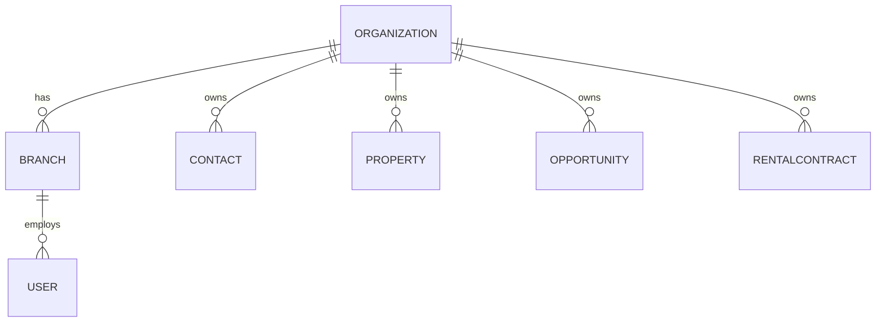

# Data Model

Conceptual domain model for Prototype v1. This is **not** a database schema
or a Prisma model — see [architecture.md](architecture.md#future-backend-architecture-not-implemented)
for why. Fields listed are the prototype's minimum; several are explicitly
flagged as pending validation with Fernández López (see
[requirements.md](requirements.md#open-questions)).

## Entity list

`Organization`, `Branch`, `User`, `Contact`, `Property`, `Opportunity`,
`Visit`, `RentalContract`, `ContractCharge`, `Payment`, `Receipt`,
`OwnerSettlement`, `Activity`.

## High-level relationships



Commercial flow:

```text
Contact
   │
   ▼
Opportunity
   │
   ├── Property
   │
   ▼
Visit
```

Rental flow:

```text
Property
    │
    ├── Owner Contact(s)
    ├── Tenant Contact(s)
    │
    ▼
RentalContract
    │
    ├── ContractCharge
    ├── Payment
    ├── Receipt
    └── OwnerSettlement
```

---

## Organization

**Purpose** — top-level tenant boundary for the future SaaS product.
Fernández López is the only organization today.

**Key fields** — `id`, `name`.

**Relationships** — has many `Branch`, `User`, `Contact`, `Property`,
`Opportunity`, `RentalContract` (all business entities carry
`organizationId`).

**Prototype assumptions** — a single mock "current organization" is enough;
no organization-switching UI is required.

**Future concerns** — real tenant isolation, billing, org-level settings.
See [architecture.md](architecture.md#multi-tenant-and-organization-awareness).

## Branch

**Purpose** — a physical/operational office (`sede`) within an
organization.

**Key fields** — `id`, `organizationId`, `name`, `address`.

**Relationships** — belongs to `Organization`; has many `User`; business
entities may carry `branchId`.

**Prototype assumptions** — Fernández López has multiple branches; a branch
selector may filter dashboards/lists.

**Open question** — see
[requirements.md](requirements.md#open-questions) item 5 (which records are
branch-scoped vs. org-wide, whether agents cross branches).

## User

**Purpose** — a person who logs into the system (staff, not a client
contact).

**Key fields** — `id`, `organizationId`, `branchId`, `name`, `email`,
`role`.

**Important enum — `role`**: `ADMIN | MANAGER | ADMINISTRATION | AGENT`. See
[product-overview.md](product-overview.md) for responsibilities per role.

**Relationships** — belongs to `Organization` and `Branch`; assigned to
`Opportunity`, `Visit`, `RentalContract` (as the responsible agent/user).

**Prototype assumptions** — no real authentication; a mock "current user"
drives role-aware UI.

**Future concerns** — real auth, session management, permission matrix
validation (open question 6).

## Contact

**Purpose** — a single record for any person the agency interacts with.
**Never** create separate records per role.

**Key fields** — `id`, `organizationId`, `fullName`, `phone`, `email`,
`assignedUserId`, `notes`, `roles`.

**Important enum — `roles`** (a contact may hold several at once):
`prospect | tenant | buyer | owner | seller`, shown in the UI as
`Interesado | Inquilino | Comprador | Propietario | Vendedor`.

**Relationships** — has many `Opportunity`, `Visit`; referenced by
`RentalContract` as `tenantIds`/`ownerIds`; referenced by `Property` as
`ownerIds`.

**Prototype assumptions** — see
[modules/contacts.md](modules/contacts.md).

## Property

**Purpose** — a real estate unit the agency manages, sells, or rents.

**Key fields**:

```text
id, organizationId, branchId, address, neighborhood, city,
latitude, longitude, propertyType, operationTypes, status,
salePrice, rentalPrice, currency, rooms, bedrooms, bathrooms,
surface, description, images, ownerIds, createdAt, updatedAt
```

**Important enums**:

- `propertyType`: apartment, house, PH, commercial property, office,
  parking, land, other (Spanish labels in UI).
- `operationTypes`: for sale, for rent (a property may be both).
- `status`: available, reserved, rented, sold, paused, under valuation.

**Relationships** — belongs to `Organization`/`Branch`; has many `Contact`
(owners), `Opportunity` (interest), `Visit`; may have one active
`RentalContract`.

**Prototype assumptions** — one dataset powers list/card/map views (see
[modules/properties.md](modules/properties.md)); not modeled to the depth of
a public property portal.

## Opportunity

**Purpose** — a specific commercial intention tied to a `Contact`. A
`Contact` is a person; an `Opportunity` is what that person currently wants
(e.g. "Juan busca un departamento de 3 ambientes en Coghlan").

**Key fields**:

```text
id, organizationId, branchId, contactId, assignedUserId, type,
status, budgetMin, budgetMax, currency, preferredNeighborhoods,
propertyTypes, rooms, notes, lastActivityAt, nextActionAt
```

**Important enums**:

- `type`: `Busca alquilar | Busca comprar | Quiere alquilar una propiedad |
  Quiere vender una propiedad`.
- `status` (buyer/tenant pipeline): `Nueva → Contactado → Propiedades
  seleccionadas → Visita → Negociación → Reserva → Cerrada`, or `Perdida`
  (with optional reason). **Provisional — open question 4.**
- Owner-side opportunities follow the acquisition workflow instead:
  `Nueva consulta → Contacto → Tasación → Captación → Propiedad publicada →
  Operación`.

**Relationships** — belongs to `Contact`, optionally to `Property`
(selected properties); has many `Visit`.

**Prototype assumptions** — see
[modules/opportunities.md](modules/opportunities.md).

## Visit

**Purpose** — a scheduled or completed property visit.

**Key fields** — `id`, `contactId`, `propertyId`, `userId`, `dateTime`,
`status`, `notes`, `outcome`.

**Important enums**:

- `status`: `Programada | Confirmada | Realizada | Cancelada |
  Reprogramada`.
- `outcome` (after `Realizada`): `Interesado | Quiere reservar | No
  interesado | Reprogramar`.

**Relationships** — belongs to `Contact`, `Property`, `User`; the outcome
feeds back into the related `Opportunity`'s status/notes.

## RentalContract

**Purpose** — the legal/financial agreement connecting a property, its
owner(s), and tenant(s).

**Key fields**:

```text
id, organizationId, branchId, propertyId, tenantIds, ownerIds,
startDate, endDate, initialRent, currentRent, currency,
adjustmentMethod, adjustmentFrequency, nextAdjustmentDate,
deposit, guaranteeType, status, documentUrl
```

**Important enums**:

- `adjustmentMethod`: `IPC | ICL | MANUAL | OTHER`.
- `adjustmentFrequency`: quarterly, four-monthly, semiannual, other/custom.

**This is the initial prototype model, not a final legal schema** —
additional mandatory fields are open question 3.

**Relationships** — belongs to `Property`; references `Contact` via
`tenantIds`/`ownerIds`; has many `ContractCharge`, `Payment`, `Receipt`,
`OwnerSettlement`.

**Prototype behavior** — expiration alerts at 90/60/30-day bands; adjustment
calculation is simulated, not connected to INDEC/BCRA. See
[modules/contracts.md](modules/contracts.md).

## ContractCharge

**Purpose** — one monthly line item owed under a contract.

**Key fields** — `id`, `contractId`, `period`, `type`, `description`,
`amount`, `status`, `dueDate`.

**Important enums**:

- `type`: `RENT | EXPENSES | ABL | AYSA | ELECTRICITY | GAS | INTEREST |
  OTHER`.
- `status`: paid, outstanding, partial, credit balance (`saldo a favor`).

**Open question** — expense responsibility rules per concept (open question
1).

## Payment

**Purpose** — a recorded payment from a tenant, optionally applied to one or
more `ContractCharge` records.

**Key fields** — `id`, `contractId`, `date`, `amount`, `method`, `notes`.

**Explicitly not modeled**: cash registers, daily close, bank
reconciliation, general ledger — see
[architecture.md](architecture.md) and
[prototype-scope.md](prototype-scope.md#explicitly-out-of-scope-for-prototype-v1).

## Receipt

**Purpose** — a document issued to the tenant after a payment is recorded.

**Conceptual fields** — agency identity, tenant, property, period, paid
concepts, amounts, total, date.

**Prototype behavior** — mock preview/printable document; no ARCA
(electronic invoicing) integration.

## OwnerSettlement

**Purpose** — the periodic calculation of what the agency owes the property
owner after collecting rent and deducting its fee and any repairs.

**Conceptual calculation**:

```text
Rent collected       $650,000
Administration fee   -$32,500
Repair                -$20,000
--------------------------------
Net to owner          $597,500
```

**Open question** — exact fee rules (open question 2).

## Activity

**Purpose** — a generic activity/history log entry (note added, stage
changed, visit completed, payment registered, etc.) attached to a `Contact`,
`Opportunity`, `Property`, or `RentalContract`, powering "Historial" tabs.

**Key fields** — `id`, `entityType`, `entityId`, `userId`, `type`,
`description`, `createdAt`.

**Prototype assumptions** — may be derived/mocked rather than a fully
generic event-sourcing system.
